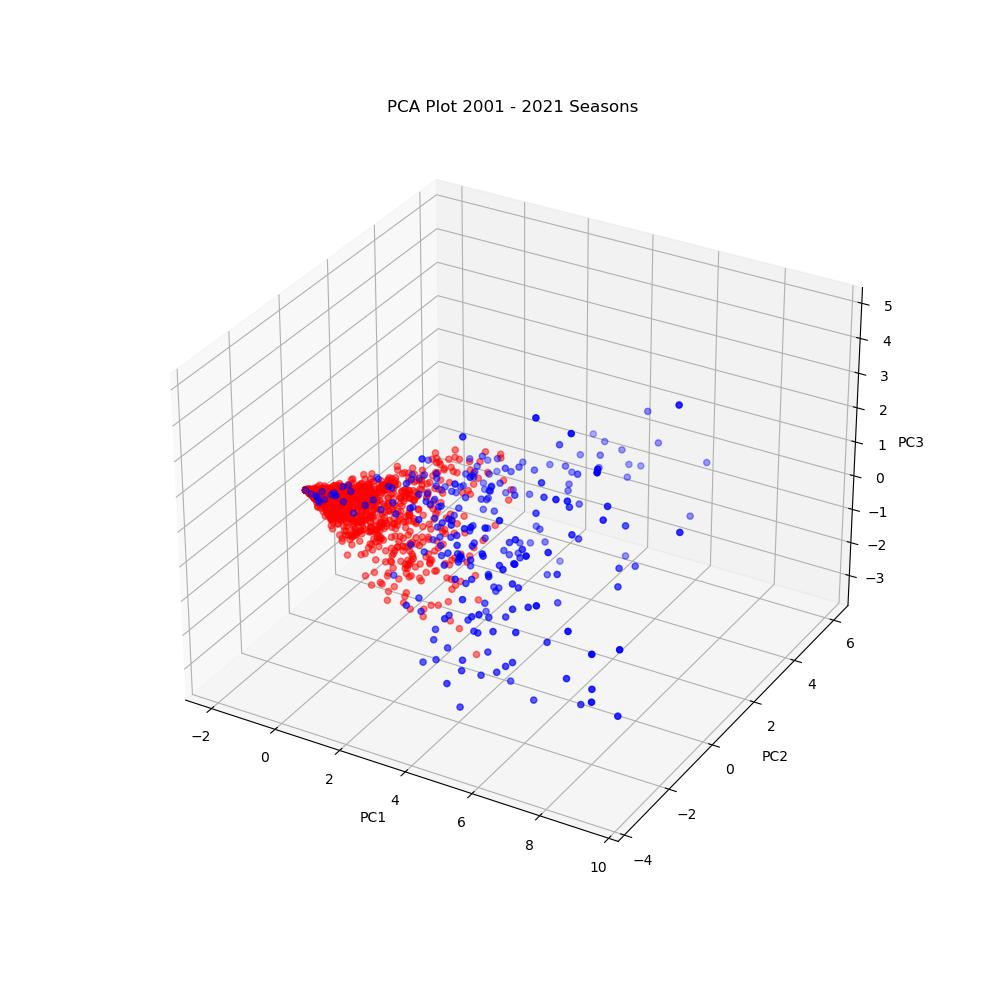

# Midterm Report

## Introduction/Background

This project will predict the NBA's annual MVP and DPOY awards, as well as the All-NBA and All-Defensive Team selections. Previous studies have explored the use of machine learning methods to forecast specific game outcomes [1], forecast future NBA rosters [2], and even forecast which college players will perform best in the NBA [3]. However, our project intends to predict which players will be selected for the All-Rookie  across the entire NBA through analyzing player statistics and team performances. By doing so, we contribute to the field of sports analytics and machine learning, offering insights into the NBA's prestigious end of season awards.

In order to achieve this, we will need a dataset of player and team stats from previous NBA seasons, and the winners of the awards at the end of those seasons. We will use a [Kaggle NBA dataset](https://www.kaggle.com/datasets/sumitrodatta/nba-aba-baa-stats/data), which encompasses detailed regular-season statistics of NBA players since the 1940s. This dataset includes player statistics such as points per game, rebounds, assists, steals, blocks, and yearly team records.

## Problem Definition
Our project's primary problem is the subjective nature of NBA team nominations. Despite the availability of player performance data, the current selection process involves human judgment, which can overlook the statistical contributions of players throughout the season. This subjectivity leads to inconsistencies in award selections.
By leveraging ML algorithms to analyze team and player statistics, we aim to develop a model that can identify patterns that correlate with award selections and team nominations to solve this problem. This approach provides a transparent method for award/team selection.

## Methods

The first methods are team decided to use was PCA for data preprocessing and and a Logistic Regression model for predictions.

### Data Preprocessing

The dataset we are using for our project is a Kaggle dataset, with players stats beginning in 1947, and continuing for every season up to 2024. This data came in the form of several CSV files. We began processing our data by combining the stats for each player across all of these files into a single Pandas dataframe. Additonally, we added the stats for the team the player played for to there row of the dataframe.

#### Data Cleaning

Since our team was only concerned with the players selected for the All-Rookie team, we modified our data to only include players in their first year. We also removed any duplicate players (who would appear if they were traded during ther duration of the season) so they would not affect our results. Since rookies are traded less frequently, and a rookie who will be selected for the All-Rookie team is almost never traded, this had little affect on our dataset. To begin working on a model, our team decided to use the 2000-2021 season for training data, and the 2022 season for testing.

#### Standard Scalar

#### PCA

### Logistic Regression Model

Accuracy: 0.97

|    | Precision | Recall | F1-score | Support |
|----|-----------|--------|----------|---------|
| 0  |   0.99    |  0.98  |   0.99   |   162   |
| 1  |   0.87    |  0.95  |   0.91   |    21   |

    

## Results

## Gantt Chart
### NBA Award Predition | Project Timeline

## Contribution Table

| Name              | Contributions                                   |
|:------------------|:------------------------------------------------|
| Matthew Brown     | Model Design and Selection   Data Preprocessing   Feature Reduction   Data Visualization   Model   Proposal |
| Rowan Chatterjee  | Model Design and Selection   Data Preprocessing   Data Visualization       |
| Wonjin Cho        | Model Design and Selection   Data Preprocessing    Feature Reduction  |
| Clark Cousins     | Model Design and Selection   Model Implementation                     |

## References

| Material Type        | Works Cited           |
|:-------------|:------------------|
| eJournal          | [1] Thabtah, F., Zhang, L. & Abdelhamid, N. NBA Game Result Prediction Using Feature Analysis and Machine Learning. Ann. Data. Sci. 6, 103–116 (2019). https://doi.org/10.1007/s40745-018-00189-x [Accessed Feb. 22, 2024] |
| eJournal | [2] Yuhao Ke, Ranran Bian, Rohitash Chandra, A unified machine learning framework for basketball team roster construction: NBA and WNBA, Applied Soft Computing, 2024, 111298, ISSN 1568-4946, https://www.sciencedirect.com/science/article/pii/S1568494624000723 [Accessed Feb. 22, 2024]   |
| eJournal          | [3] Philip Maymin (2021) Using Scouting Reports Text To Predict NCAA → NBA Performance, Journal of Business Analytics, 4:1, 40-54, DOI: https://www.tandfonline.com/doi/full/10.1080/2573234X.2021.1873077 [Accessed Feb.22, 2024]      |