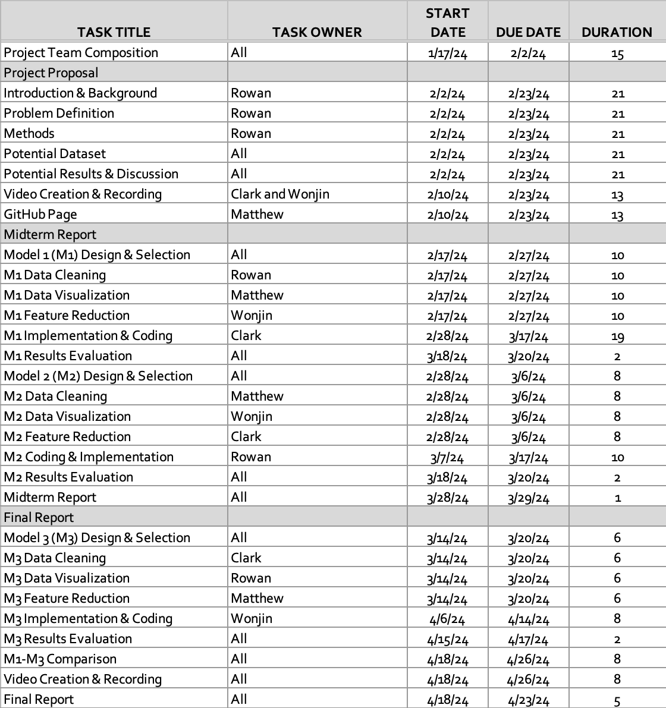

# Project Proposal

<iframe width="560" height="315" src="https://www.youtube.com/embed/vJpRFSSnvL4" frameborder="0" allowfullscreen></iframe>

## Introduction/Background

This project will predict the NBA's annual MVP and DPOY awards, as well as the All-NBA and All-Defensive Team selections. Previous studies have explored the use of machine learning methods to forecast specific game outcomes [1], forecast future NBA rosters [2], and even forecast which college players will perform best in the NBA [3]. However, our project intends to predict end of season awards across the entire NBA through analyzing player statistics and team performances. By doing so, we contribute to the field of sports analytics and machine learning, offering insights into the NBA's prestigious end of season awards.

In order to achieve this, we will need a dataset of player and team stats from previous NBA seasons, and the winners of the awards at the end of those seasons. We will use a [Kaggle NBA dataset](https://www.kaggle.com/datasets/sumitrodatta/nba-aba-baa-stats/data), which encompasses detailed regular-season statistics of NBA players since the 1950s. This dataset includes player statistics such as points per game, rebounds, assists, steals, blocks, and yearly team records.

## Problem Definition
Our project's primary problem is the subjective nature of NBA award selections and team nominations. Despite the availability of player performance data, the current selection process involves human judgment, which can overlook the statistical contributions of players throughout the season. This subjectivity leads to inconsistencies in award selections.
By leveraging ML algorithms to analyze team and player statistics, we aim to develop a model that can identify patterns that correlate with award selections and team nominations to solve this problem. This approach provides a transparent method for award/team selection.

## Methods

- Data Preprocessing Methods
    - Feature engineering
        - We will reduce feature dimensionality using PCA, so we can remove less important stats. We will also engineer new features.
    - Normalization/Standardization
        - We will use StandardScalar from scikit-learn in order to normalize our features. Since players on average score many more points per game than assists/rebounds per game, we will normalize these features to prevent skewing.
    - Handling missing values
        - We can use a library such as SimpleInputer from scikit-learn to fill in missing values with statistically relevant replacements

- ML Algorithms/Models
    - Random Forest Classifier
        - Using the RandomForestClassifier library in scikit-learn will be helpful for handling the non-linear relationships between players stats, team wins, and award selections.
    - K-Nearest-Neighbors
        - Using the KNeighborsClassifier library in scikit-learn with normalized features will be helpful for predicting team selections.
    - Logistic Regression
        - Using the LogisticRegression library in scikit-learn will help classify whether a player should be in consideration for an award.

Random Forests, KNN, and Logistic regression are all under the umbrella of supervised learning, so our project will be entirely supervised learning.

## Results and Discussion

- Quantitative Metrics
    - Accuracy score
    - Precision and recall
    - F1 score

Our project goals consist of the following: Achieve an accuracy score of over 80%, and maintain a precision, recall, and f1 score of over 75%. Given that we are predicting human-voted awards, achieving these metrics would demonstrate success in applying ML to sports analytics.

## Gantt Chart
### NBA Award Predition | Project Timeline

## Contribution Table

| Name              | Contributions                                   |
|:------------------|:------------------------------------------------|
| Matthew Brown     | Helped with problem definition   Created GitHub and setup website   Gantt Chart   Contribution Table   Proposal editing |
| Rowan Chatterjee  | Helped with problem definition   Searched for dataset   Typed proposal       |
| Wonjin Cho        | Helped with problem definition   Proposal editing   Slides for proposal presentation |
| Clark Cousins     | Helped with problem definition   Recorded proposal presentation                     |

## References

| Material Type        | Works Cited           |
|:-------------|:------------------|
| eJournal          | [1] Thabtah, F., Zhang, L. & Abdelhamid, N. NBA Game Result Prediction Using Feature Analysis and Machine Learning. Ann. Data. Sci. 6, 103–116 (2019). https://doi.org/10.1007/s40745-018-00189-x [Accessed Feb. 22, 2024] |
| eJournal | [2] Yuhao Ke, Ranran Bian, Rohitash Chandra, A unified machine learning framework for basketball team roster construction: NBA and WNBA, Applied Soft Computing, 2024, 111298, ISSN 1568-4946, https://www.sciencedirect.com/science/article/pii/S1568494624000723 [Accessed Feb. 22, 2024]   |
| eJournal          | [3] Philip Maymin (2021) Using Scouting Reports Text To Predict NCAA → NBA Performance, Journal of Business Analytics, 4:1, 40-54, DOI: https://www.tandfonline.com/doi/full/10.1080/2573234X.2021.1873077 [Accessed Feb.22, 2024]      |

