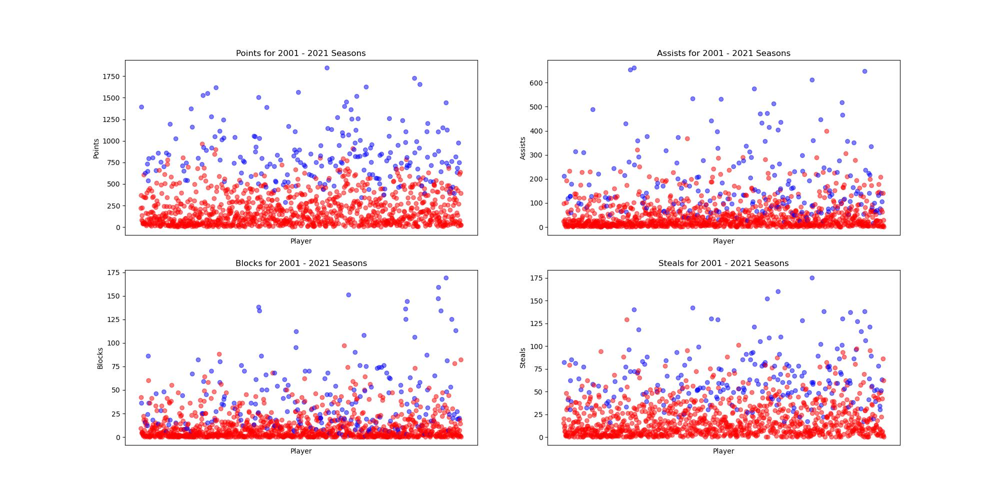

# Final Report

## Introduction/Background

This project will predict the NBA's annual All-Rookie Team selections. Previous studies have explored the use of machine learning methods to forecast specific game outcomes [1], forecast future NBA rosters [2], and even forecast which college players will perform best in the NBA [3]. However, our project intends to predict which players will be selected for the All-Rookie teams across the entire NBA through analyzing player statistics. By doing so, we contribute to the field of sports analytics and machine learning, offering insights into the NBA's prestigious end of season awards.

In order to achieve this, we will need a dataset of player and team stats from previous NBA seasons, and the winners of the awards at the end of those seasons. We will use a [Kaggle NBA dataset](https://www.kaggle.com/datasets/sumitrodatta/nba-aba-baa-stats/data), which encompasses detailed regular-season statistics of NBA players since the 1940s. This dataset includes player statistics such as points per game, rebounds, assists, steals, blocks, and yearly team records.

## Problem Definition
Our project's primary problem is the subjective nature of NBA team nominations. Despite the availability of player performance data, the current selection process involves human judgment, which can overlook the statistical contributions of players throughout the season. This subjectivity leads to inconsistencies in award selections.
By leveraging ML algorithms to analyze team and player statistics, we aim to develop a model that can identify patterns that correlate with award selections and team nominations to solve this problem. This approach provides a transparent method for award/team selection.

## Methods

The methods our team decided to use on processing data were StandardScalar for scaling the data, PCA for data preprocessing. Then, our team decided to use a Logistic Regression model, KNN model, NN model, and GMM model for predictions.

### Data Preprocessing

The dataset we are using for our project is a Kaggle dataset, with player stats beginning in 1947, and continuing for every season up to 2024. The dataset contains statistics for 31000 players. This data came in the form of several CSV files, each containing many different features. We began processing our data by combining the stats for each player across all of these files into a single Pandas dataframe. Additionally, we added the stats for the team the player played on to their row of the dataframe.

#### Data Cleaning

Since our team was only concerned with the players selected for the All-Rookie team, we modified our data to only include players in their first year. We also removed any duplicate players (who would appear if they were traded during ther duration of the season) so they would not affect our results. Since rookies are traded less frequently, and a rookie who will be selected for the All-Rookie team is almost never traded, this had little effect on our dataset. To begin working on a model, our team decided to use the 2000-2021 seasons for training data, and the 2022 season for testing. To begin visualising our data, we plotted several key stats for the players in our training data, shown below. Using this visual data, our team was able to manually select the features that seemed most relevant for deciding which player would make the All-Rookie team. In blue are players who made the All-Rookie teams their rookie year, and in red are players that did not.

#### Standard Scalar

Before performing PCA, we scaled our data using the StandardScalar library in sklearn to take into account the difference in player performance across different seasons. The averages for certain stats like points per game have gone up through the years, so in order to account for this we normalized the data. The scaled data is shown in the plot below. In blue are players who made the All-Rookie teams their rookie year, and in red are players that did not.

#### PCA

After scaling the training and testing data, we used the PCA (Principle Component Analysis) class in sklearn to reduce the dimensionality of our data. Using PCA, we obtained the 4 principle components that would retain 95% of the variance in our data. The first 3 principle components are shown below. As can be seen in the plot, there is a large amount of separation between most of the players selected for the All-Rookie team and those not selected. In blue are players who made the All-Rookie teams their rookie year, and in red are players that did not.

### Models

#### Logistic Regression Model

In order to make predictions, our team decided to use a logistic regression model for classification. We used the LogisticRegression class in sklearn to perform the classification. The model first splits the training data (2001 - 2021 seasons) into training and test data, with 30% of the data being used for testing. The data is inherently unbalanced between players selected for the All-Rookie team and those not selected since only 10 players are selected per season. To counter this, we added weights to the classes so the model would favor the All-Rookie class. We ran the model several times, and obtained the best results with weights of 1 for the not selected class and 3 for the All-Rookie class. In the model, 0 is used to represent a player not selected, and 1 is used for players that are selected.

#### K-Nearest Neighbors

The next model our team opted to use was k-Nearest Neighbors. We used the KNeighborsClassifier from sklearn to perform the classification. Again, we split training data into training and test splits, this time using 20% of the data for testing. The next step in the process was determining which value of k to use.

To solve this problem, we trained several models on k's ranging from 1 to 39, then picked the k that resulted in the most accurate model. We found that k = 29 was optimal based on raw accuracy, but k=19 produced a better F1 score. We opted to use k=19 because our model should be able to classify all rookies (so precision and recall matter), but the model performs well even with fewer neighbors. Below is a graph comparing cross-validated F1 Scores across various k-values. 

#### Neural Network

We also trained a Neural Network for this project. We used TensorFlow's Keras API to build a Neural Network with 2 leaky ReLU activation hidden layers and a Sigmoid activation output layer. We split the same training data set into training and test splits, and stuck with a 20% split for testing data. The next step was to determine the best hyperparameters for the model.

After trying numerous combinations of neurons in each layer, batch size, and epochs, we found that 32 neurons in the first layer, 64 neurons in the second layer, 40 epochs, and a batch size of 64 produced the best F1 score of 77%.

#### Gaussian Mixture Model

While we were building our other models, we became curious about how an unsupervised model would perform. Using the GaussianMixture class from sklearn, we trained a GMM model on the same data set of 310 players, with the same 20% split for testing data. The results were underwhelming, and we ended up not moving along with using the model to predict the 2022 All-Rookie class. 

## Results

### Logistic Regression
Below is a table showing several measurements of our model's performance. Our model using logistic regression performed much better than we initially expected. The most notable of these metrics is the 0.86 precision for class 1. This means that 86% of players predicted to make the All-Rookie team did make the team. Additionally, based on the recall for class 1, the model correctly identifies 97% of All-Rookie players. Note that these are the results for a model trained on a random split of the data into a training set and a testing set, and they can change slightly depending on how the data is divided.

Accuracy: 97%

|    | Precision | Recall | F1-score | Support |
|----|-----------|--------|----------|---------|
| 0  |   0.99    |  0.98  |   0.98   |   268   |
| 1  |   0.87    |  0.93  |   0.90   |    42   |

The below figure shows the confusion matrix for predictions made on the test data. Of the 274 players in the testing data, there were 268 players who were not selected for the All-Rookie team and 42 players who were. The logistic regression model correctly identified 39 All-Rookies, and was not able to identify 3 All-Rookie. Then model correctly identified 262 of the non-All-Rookie players, and misidentified 6 non-All-Rookie players as All-Rookie.

    

The goal of our model was to be able to accurately predict the All-Rookie players for any given season, based on their current stats. After training our model, we used it to calculate the probabilites of each player for the 2022 season to make the All-Rookie team and then output the 10 most likely players. We used the model in this way because it is gauranteed that there will be 10 All-Rookie players each season. Below are the results for the logistic regression model.

2022 Season All-Rookie Team: Cade Cunningham, Evan Mobley, Franz Wagner, Jalen Green, Scottie Barnes, Ayo Dosunmu, Bones Hyland, Chris Duarte, Herbert Jones, Josh Giddey

2022 Season Predicted All-Rookie Team: Evan Mobley, Cade Cunningham, Scottie Barnes, Franz Wagner, Herbert Jones, Alperen Şengün, Jalen Green, Davion Mitchell, Josh Giddey, Ayo Dosunmu

Incorrect Positive Predictions: Alperen Şengün, Davion Mitchell

Incorrect Negative Predictions: Bones Hyland, Chris Duarte

Based on these results, the model was able to correctly identify 8 out of the 10 All-Rookies from the 2022 season.

### K-Nearest Neighbors
Below we have a table showing performance measurements for our KNN model. Our KNN model performed better than expected! A precision score of 97% for class 1 means 97% of the players the model said would make the All-Rookie team made it, which is a better mark than our Logistic Regression Model. However, KNN struggled significantly with recall compared to LR, with only 71%. 

Accuracy: 95.8%

|    | Precision | Recall | F1-score | Support |
|----|-----------|--------|----------|---------|
| 0  |   0.96    |  1.00  |   0.98   |   268   |
| 1  |   1.00    |  0.74  |   0.85   |    42   |

The below figure shows the confusion matrix for predictions made on the test data of 310 players. The model correctly characterized all 268 non All-Rookie members as such, and therefore did not incorrectly predict any non All-Rookie members to take home the award. It did, however, predict 11 players that would make the All-Rookie to not do so. It correctly predicted 31 All-Rookie members. 

    

After training our model, we used it to calculate the probabilities of each 2022 rookie to make the All-Rookie team and ouput the 10 most likely players. Here are the 10 most likely players, according to the model, and their associated probabilities.

|      player     |   probability   | 
| ----------------|-----------------|
| Cade Cunningham |      1.00       |
|   Evan Mobley   |      1.00       |
|   Jalen Green   |      1.00       |
|  Scottie Barnes |      1.00       | 
|   Franz Wagner  |      0.9375     |
|  Alperen Şengün |      0.8750     |
| Davion Mitchell |      0.8750     |
|  Herbert Jones  |      0.8750     |
|   Josh Giddey   |      0.8750     |
|   Ayo Dosunmu   |      0.6875      |

Again, our model correctly identified 8 of the 10 All-Rookies from 2022 and actually predicted the same set of 10 players as our Logistic Regression Model.

Incorrect Positive Predictions: Alperen Şengün, Davion Mitchell

Incorrect Negative Predictions: Bones Hyland, Chris Duarte

### Neural Network
Below we have a table showing performance measurements for our Neural Network model. Our NN performed rather similarly to our KNN model, with slightly worse precision but also slightly beter recall. All in all, the NN had a worse F1-score while classifying All-Rookie members.

Accuracy: 94.7%, Loss: 10.2%

|    | Precision | Recall | F1-score | Support |
|----|-----------|--------|----------|---------|
| 0  |   0.96    |  0.99 |   0.98   |   268   |
| 1  |   0.91    |  0.76  |   0.83   |    42   |

We also generated the confusion matrix for the NN, and have displayed it below. Over the same data set of 310 players, our NN correctly classified 265 of the 268 players that did not make All Rookie, incorrectly predicting 3 players that did not make all-Rookie to do so. It correctly labeled 32 players as All-Rookie members but labeled 10 players that did not make the All-Rookie team to do so.

    

We used a similar methodology as LR and KNN to generate the 10 most likely members of the 2022 All-Rookie team, and here are the results the model gave:

|      player     |   probability   | 
| ----------------|-----------------|
| Evan Mobley     |     0.999         |
| Cade Cunningham |      0.998       |
|   Scottie Barnes   |      0.997       |
|  Franz Wagner |      0.988       | 
|   Herbert Jones  |      0.988     |
|  Alperen Şengün |      0.979     |
| Josh Giddey     |      0.974     |
|  Jalen Green    |      0.966     |
|   Davion Mitchell   |      0.964     |
|   Ayo Dosunmu   |      0.899      |

Our model predicted the same set of rookies as our Logistic Regression and K-Nearest Neighbor models, which means it scored an 80% for accuracy for this prediction. It presented the team in a slightly different ordering of probabilities compared the the previous models. 

Incorrect Positive Predictions: Alperen Şengün, Davion Mitchell

Incorrect Negative Predictions: Bones Hyland, Chris Duarte

## Gaussian Mixture Model
GMM performed significantly worse than all three supervised models, posting an accuracy of 75.8% on the testing data. For that reason, we ended up not using it to predict 2022 rookies. Below is the confusion matrix for the GMM clustering, and we can see that the model struggled significantly with players that did not win All-Rookie honors. 

    

Below are the clusters the model generated. In blue are the players it predicted to not make All-Rookie, and in red are the players it did. It appears that GMM has a hard time capturing exactly what makes a rookie as impactful as an All-Rookie member, and will particularly struggle with borderline players. 

    

## Discussion
Our models performed rather well. When we set out on this project, we set goals of an Accuracy score greater than 80%, Precision and Recall both greater than 75%, and an F1 Score greater than 75%. All of our models achieved that mark, reaching 80% accuracy for all 2022 All-Rookie predictions. Of the three models we trained to predict results, Logistic Regression performed the best, putting up the highest F1-Score while predicting awards of 90% and a recall of 93%. The Neural Network performed the worst, posting an F1-Score of 83% and a recall of 76%. KNN sat in the middle, with an F1 Score of 85% and a recall of 74%. 

Logistic Regression likely succeeded due to a variety of reasons. The weightings given to the data before training allowed the model to navigate a data set with relatively few All-Rookie winners. Other models were not able to capture this. Another reason is the more linear nature of the relationship between statistics and rookie awards. As a trend, we found that players who score more points while playing more games ended up being awarded with All-Rookie honors. It's likely that LR handled that relationship very well. As a whole, all models struggled on picking "borderline" players. 

Curiously, each model missed on 2 players: Bones Hyland and Chris Duarte, while incorrectly predicting Alperen Şengün and Davion Mitchell to take All-Rookie honors. Below are their stats for their 2022 rookie campaigns.

| player | games | PPG | APG | RPG | BPG | SPG | FG% | 
|---------|-------|-----|-----|----|-----|----|----|
| Alperen Şengün | 72 | 9.6 | 2.6 | 5.5 | 0.9 | 0.8 | 47.4 |
| Davion Mitchell | 75 | 11.5 | 4.2 | 2.2 | 0.3 | 0.7 | 41.8 |
| Chris Duarte | 55 | 13.1 | 2.1 | 4.1 | 0.2 | 1.0 | 43.2 |
| Bones Hyland | 69 | 10.1 | 2.8 | 2.7 | 0.3 | 0.6 | 40.3 |

We can see that the voters had a difficult task when it came down to those last two spots! To see how close our model thought it was, we expanded each model until their predictions included all 10 correct members of the 2022 All-Rookie team. Each model had the entire team within their 13 most likely candidates. 

## Conclusion

Accurately predicting the results of human voting is a difficult task. In the world of sports, where criticism of players occurs nightly, it is hard for a model to recognize every storyline in the back of a voter's mind. In the end, we were able to train several models that sufficiently predicted All-Rookie winners. We set out hoping to achieve 80% accuracy with our models' predictions, and that's exactly what we did. 

Some future work in this space could be the introduction of team data. One thing each of our models fail to capture are the non-statistic impacts each player has. For example, though Bones Hyland's season averages appear to be worse than Davion Mitchell's, Bones' impact in the second half of the season and playoffs likely led to his selection for the team. A model that could take team success into account could produce more accurate results, especially if that model was able to track year-to-year changes in team success. To use an example from these past two years: During the 2022-2023 season, the San Antonio Spurs were the worst team in basketball, having a league-worst Offensive and Defensive Rating. With the first pick in the NBA Draft that offseason, they selected Victor Wembanayama, who would develop into a superstar within his first year in the league. The Spurs climbed the rankings in both Offensive and Defensive Rating, and added 6 expected wins, despite Wembanyama being the only significant roster change. 

Our models may serve as another tool in the sports analytics field, providing a low-stakes estimate of what rookies are performing best any given season. 

## Gantt Chart
### NBA Award Predition | Project Timeline

## Contribution Table

| Name              | Final Contributions                                   |
|:------------------|:------------------------------------------------|
| Matthew Brown     | Model Design and Selection   Data Preprocessing   Feature Reduction   Data Visualization   Model Implementation  Proposal |
| Rowan Chatterjee  | Model Design and Selection   Data Preprocessing   Data Visualization    Proposal     |
| Wonjin Cho        | Model Design and Selection   Data Preprocessing    Feature Reduction   Video Presentation |
| Clark Cousins     | Model Design and Selection   Model Implementation   Report   Video Presentation |

## References

| Material Type        | Works Cited           |
|:-------------|:------------------|
| eJournal          | [1] Thabtah, F., Zhang, L. & Abdelhamid, N. NBA Game Result Prediction Using Feature Analysis and Machine Learning. Ann. Data. Sci. 6, 103–116 (2019). https://doi.org/10.1007/s40745-018-00189-x [Accessed Feb. 22, 2024] |
| eJournal | [2] Yuhao Ke, Ranran Bian, Rohitash Chandra, A unified machine learning framework for basketball team roster construction: NBA and WNBA, Applied Soft Computing, 2024, 111298, ISSN 1568-4946, https://www.sciencedirect.com/science/article/pii/S1568494624000723 [Accessed Feb. 22, 2024]   |
| eJournal          | [3] Philip Maymin (2021) Using Scouting Reports Text To Predict NCAA → NBA Performance, Journal of Business Analytics, 4:1, 40-54, DOI: https://www.tandfonline.com/doi/full/10.1080/2573234X.2021.1873077 [Accessed Feb.22, 2024]      |

